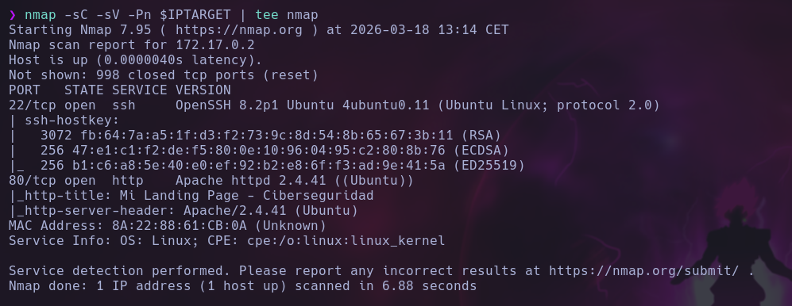

# ShowTime

## 🕵️ Reconocimiento

Comenzamos con un escaneo de puertos usando `nmap`:


```bash
nmap -sC -sV -Pn $IPTARGET
```


<figure><figcaption></figcaption></figure>

Los únicos puertos abiertos son el del servicio web y el de SSH. Con un escaneo de directorios encontramos lo siguiente:


```bash
ffuf -w /usr/share/wordlists/SecLists-2025.2/Discovery/Web-Content/directory-list-2.3-medium.txt:FUZZ -u "http://$IPTARGET/FUZZ" -e .html,.php,.txt,.xml,.js
```


<figure><figcaption></figcaption></figure>

Si nos vamos al directorio `/login_page`, encontramos un formulario de inicio de sesión. Probando combinaciones típicas, como `admin:admin` o `admin:admin123`, no se obtiene nada. Si introducimos el caracter `'` en el campo de contraseña, obtenemos un mensaje de error de SQL, lo que nos indica que no está sanitizando correctamente la entrada y es muy probable que podamos aprovecharnos de un SQLI.

<figure><figcaption></figcaption></figure>

Con `burpsuite` vemos que la petición POST del login se hace a `/login_page/auth.php`, con los campos `usuario` y `contraseña`.&#x20;

<figure><figcaption></figcaption></figure>

Con `sqlmap` encontramos que el formulario es vulnerable a 3 tipos de SQLI, entre ellos, un time-based blind (relacionado con el nombre de la máquina).


```bash
sqlmap -u "http://172.17.0.2/login_page/auth.php" --data="usuario=admin&contraseña=admin" --batch --level=5 --risk=3 --dbs
```


<figure><figcaption></figcaption></figure>

## 🚪 Ganando acceso

Primero, vemos el contenido de la base de datos `users`.


```bash
sqlmap -u "http://172.17.0.2/login_page/auth.php" --data="usuario=admin&contraseña=admin" --batch --level=5 --risk=3 -D users --tables
```


<figure><figcaption></figcaption></figure>

Dentro de esta base de datos, vemos la única tabla llamada `usuarios`. Veamos qué hay dentro de esta tabla.


```bash
sqlmap -u "http://172.17.0.2/login_page/auth.php" --data="usuario=admin&contraseña=admin" --batch --level=5 --risk=3 -D users -T usuarios --dump
```


<figure><figcaption></figcaption></figure>

Podemos iniciar sesión con el último usuario de esta tabla, con las credenciales `joe:MiClaveEsInhackeable`. Accedemos a un panel donde podemos ejecutar código en python:

<figure><figcaption></figcaption></figure>

Si introducimos un código en python para generar una reverse shell, podemos ganar acceso a la máquina.

<figure><figcaption></figcaption></figure>

## 💥 Escalada de privilegios

En el directorio `/tmp` se encuentra un fichero llamado `.hidden_text.txt`. El contenido de este fichero es una lista de trucos del San Andreas (qué recuerdos...).

<figure><figcaption></figcaption></figure>

<figure><figcaption></figcaption></figure>

Esta lista probablemente sea una wordlist para acceder con alguno de los dos usuarios de la máquina (mirando el `/etc/passwd` sabemos los usuarios que hay). Probamos con `hydra` y no obtenemos nada.

<figure><figcaption></figcaption></figure>

Pasando la wordlist de mayúsculas a minúsculas, encontramos finalmente la contraseña del usuario `joe`.


```bash
tr 'A-Z' 'a-z' < wordlist > wordlist_lower
```


<figure><figcaption></figcaption></figure>

Una vez accedemos con este usuario, vemos los permisos que tenemos con `sudo`. Podemos ganar acceso directo al usuario `luciano`, ya que posh es un programa que nos habilita una shell, y podemos ejecutarlo como luciano sin necesidad de contraseña.

<figure><figcaption></figcaption></figure>

Con el usuario luciano vemos que tenemos permiso para ejecutar `/bin/bash /home/luciano/script.sh` como root sin introducir contraseñas.

<figure><figcaption></figcaption></figure>

Si miramos el script, vemos que es una reverse shell (gracias).

<figure><figcaption></figcaption></figure>

Cambiamos la IP con `sed -i 's/192.168.1.100/172.17.0.1/' script.sh` y ejecutamos el script con sudo a la vez que estamos a la escucha en nuestra máquina atacante.

<figure><figcaption></figcaption></figure>

Obtenemos acceso a la máquina víctima como root.
