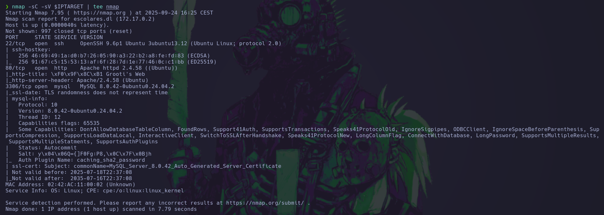

# 🟩 WhereIsMyWebShell

## 🕵️ Reconocimiento

Comenzamos con un escaneo de puertos con `nmap`:

```bash
nmap -sC -sV -Pn $IPTARGET | tee nmap
```

<figure><figcaption></figcaption></figure>

Solo se encuentra el puerto del servicio web activo. Procedemos a realizar un escaneo de directorios:


```bash
ffuf -w /usr/share/wordlists/SecLists-2025.2/Discovery/Web-Content/directory-list-2.3-medium.txt:FUZZ -u "http://$IPTARGET/FUZZ" -e .html,.php,.txt,.xml,.js
```


<figure><figcaption></figcaption></figure>

Si entramos a la página `warning.html`, encontramos el siguiente mensaje:

<figure><figcaption></figcaption></figure>

Tendremos que realizar un escaneo de parámetros en `shell.php` para ver qué parametro es el utilizado para la webshell.


```bash
ffuf -w /usr/share/wordlists/SecLists-2025.2/Discovery/Web-Content/burp-parameter-names.txt:FUZZ -u "http://$IPTARGET/shell.php?FUZZ=whoami" -mc 200
```


<figure><figcaption></figcaption></figure>

Vemos que el parámetro es `parameter`. Con esto podemos ejecutar comandos en la máquina víctima.

## 🚪 Ganando acceso

Con burpsuite capturamos la petición e inyectamos el comando que nos ejecuta la reverse shell. En este caso he usado PHP con la herramienta [reverse shell generator](https://www.revshells.com/).

<figure><figcaption></figcaption></figure>

Nos ponemos a la escucha con `netcat` y mandamos la petición.

<figure><figcaption></figcaption></figure>

## 💥 Escalada de privilegios

Buscamos los ficheros .txt en el sistema. Encontramos un fichero en `/tmp/.secret.txt`:

<figure><figcaption></figcaption></figure>

Este fichero contiene la contraseña de `root`, por lo que nos da acceso directo.

<figure><figcaption></figcaption></figure>
